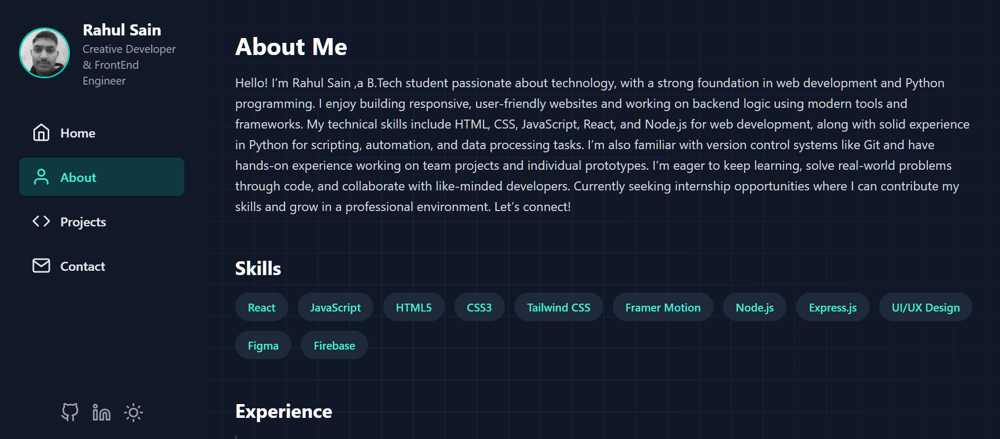

# 🌐 Rahul Sain – Full-Stack Web Developer

A modern and interactive developer portfolio showcasing my projects, skills, and experience in building responsive web applications.  
Crafted with **React.js**, styled with **Tailwind CSS**, and enhanced with smooth **Framer Motion** animations, this portfolio highlights my passion for clean design, performance, and user-friendly interfaces.

---

## 📸 Preview


---

## 🚀 Tech Stack
- ⚛️ **React.js** – Component-based UI  
- 🎨 **Tailwind CSS** – Utility-first styling  
- 🎭 **Framer Motion** – Animations & transitions  

---

## 🔑 Features
- Responsive design for all devices  
- Smooth animations and transitions  
- Clean, modern UI with reusable components  
- Showcases projects, skills, and contact info  

---

## 🛠️ Getting Started
```bash
# Clone the repo
git clone https://github.com/Anos714/Portfolio

# Go to project folder
cd Portfolio

# Install dependencies
npm install

# Start development server
npm run dev
